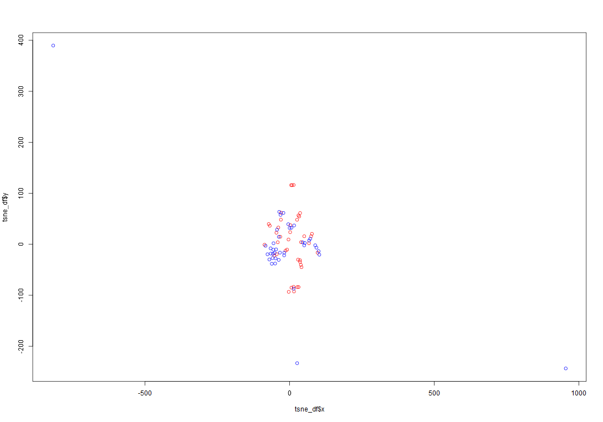
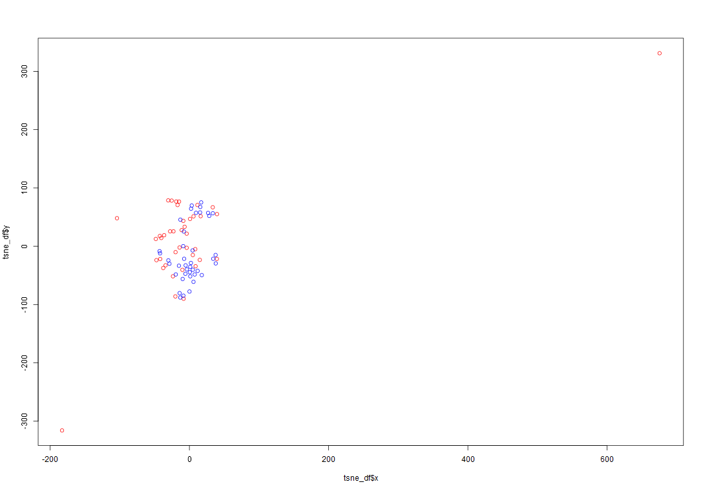
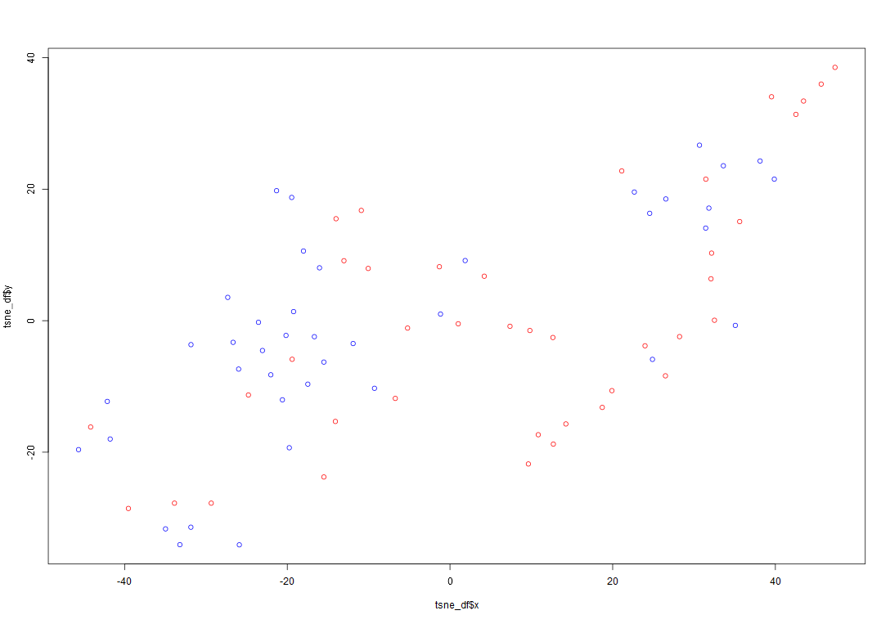
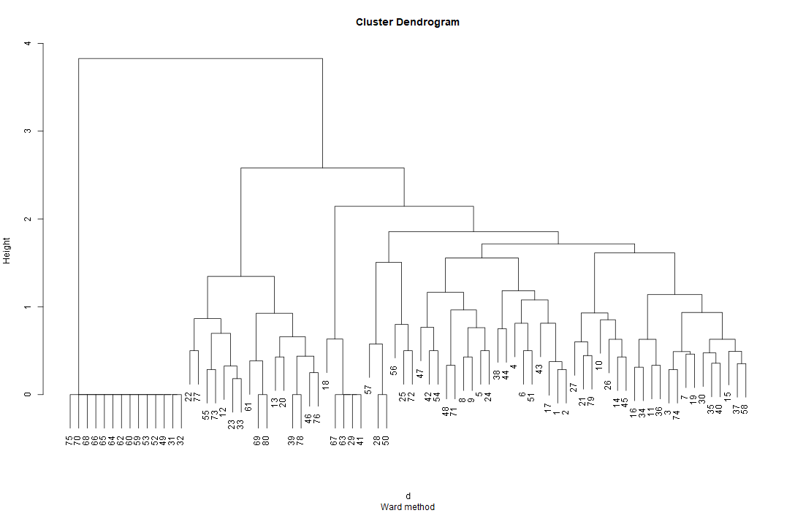
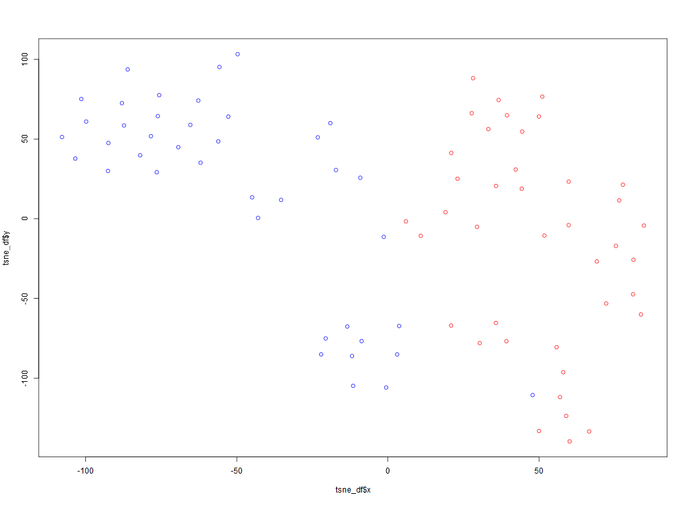

# ML_semester
ML_semester

My work is to deal with the dataset: SPECT

Attributs infomation about SPECT dataset:
```
Attribute Information:
   1.  OVERALL_DIAGNOSIS: 0,1 (class attribute, binary)
   2.  F1:  0,1 (the partial diagnosis 1, binary)
   3.  F2:  0,1 (the partial diagnosis 2, binary)
   4.  F3:  0,1 (the partial diagnosis 3, binary)
   5.  F4:  0,1 (the partial diagnosis 4, binary)
   6.  F5:  0,1 (the partial diagnosis 5, binary)
   7.  F6:  0,1 (the partial diagnosis 6, binary)
   8.  F7:  0,1 (the partial diagnosis 7, binary)
   9.  F8:  0,1 (the partial diagnosis 8, binary)
   10. F9:  0,1 (the partial diagnosis 9, binary)
   11. F10: 0,1 (the partial diagnosis 10, binary)
   12. F11: 0,1 (the partial diagnosis 11, binary)
   13. F12: 0,1 (the partial diagnosis 12, binary)
   14. F13: 0,1 (the partial diagnosis 13, binary)
   15. F14: 0,1 (the partial diagnosis 14, binary)
   16. F15: 0,1 (the partial diagnosis 15, binary)
   17. F16: 0,1 (the partial diagnosis 16, binary)
   18. F17: 0,1 (the partial diagnosis 17, binary)
   19. F18: 0,1 (the partial diagnosis 18, binary)
   20. F19: 0,1 (the partial diagnosis 19, binary)
   21. F20: 0,1 (the partial diagnosis 20, binary)
   22. F21: 0,1 (the partial diagnosis 21, binary)
   23. F22: 0,1 (the partial diagnosis 22, binary)
```

## Work1
The 3 classification methods I choose are: decision tree, svm, adaboost.

For decision tree, the best model is the original one without pruned.

Error rate:
```
[1] "Error rate:  0.240641711229947"
```

For adaboost, the best model is with 221 tree models.

Error rate:
```
[1] "The cost with minimum:  221 Min value:  0.197860962566845"
```

For svm, the best model is set with parameters: cost = , kernel = radial

Error rate:
```
[1] "The cost with minimum:  0.1 Min value:  0.144385026737968"
```

I used perplexity = 1, 4, 6 to draw the tnse images:




## Work2
The model with least error rate is svm.

## Work3
The dendrogram by using Ward.D Hierarchical Clustering method using "binary" distance is as followed:


Error rate:
```
"erorr_rate 0.375"
```

## Work4
I use cv.glmnet to get the lasso regression model with best cross-validation value.
The model's parameters:
```
22 x 1 sparse Matrix of class "dgCMatrix"
             s0
V2   .
V3   .
V4  -0.18940438
V5   0.08473530
V6   .
V7   0.02812510
V8   0.09967938
V9   0.26508012
V10  .
V11  0.04980902
V12  0.19759099
V13  .
V14  0.29002100
V15  .
V16  .
V17  0.10251969
V18  0.10532508
V19  .
V20  .
V21  0.05662785
V22  .
V23  0.11253767
```

We can see that the data dimensions' parameters of V2,V3,V6,V10,V13,V15,V16,V19,20,V22 are 0, which means such data dimensions are not used in the model. The dimensions has the most influence on the model are V14 and V9.

## Work5
I used a NN-model with size 26x64x32x8x32x64x26 to reduce the dimension of original dataset from 26 to 8. And actually it reduces the dimension from 26 to 6, because 2 of dimensions are columns with 0s.

Then I created a svm classifier from the dimension-reduced dataset. I used this svm model to predict the encoded train and test datasets the error rates are as followed:
```
[1] "Train error 0.0625"
[1] "Test error 0.149732620320856"
```

This method does have not bad result.

Then we can draw a new tsne image from the encoded data from the training dataset:


The new tsne images shows a nice dimension-reduced x-y image where we can easily use a straight line to devide the data into red and blue classes and it shows likelihood to classify the data with lower dimension with better results. The perplexity of this tsne image is set to 7.


